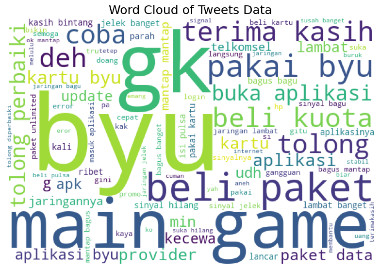
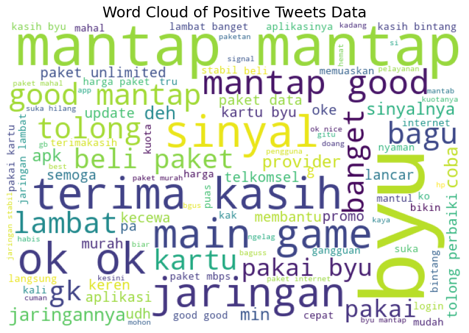
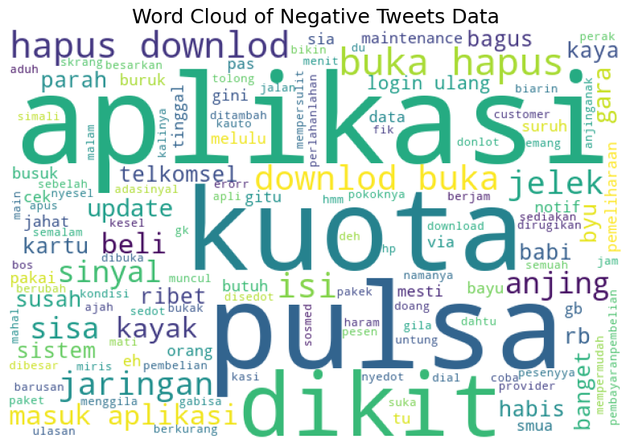
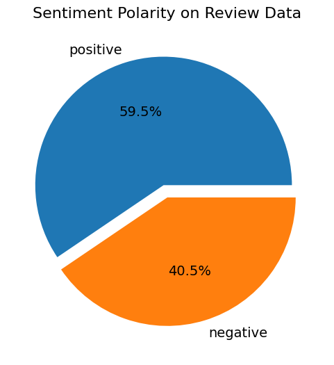
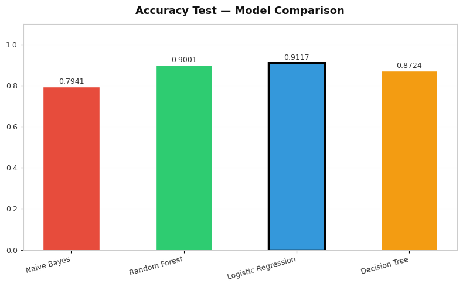

# by.U App Sentiment Analysis

A comprehensive sentiment analysis project that analyzes user reviews from the by.U mobile application using natural language processing and machine learning techniques.

## Overview

This project extracts and analyzes 227,588+ customer reviews from the by.U telecommunications application to understand user sentiment, identify pain points, and evaluate customer satisfaction. The analysis includes data preprocessing, sentiment classification, and statistical insights on user feedback patterns.

## Dataset

- **Source**: by.U application reviews from Google Play Store
- **Records**: 227,588 reviews
- **Features**:
  - User reviews and ratings
  - Timestamps and version information
  - Official company responses
  - User engagement metrics (thumbs up count)

## Visualizations

### Word Cloud Analysis



The word cloud above represents the most frequently occurring terms in all user reviews. Larger text indicates more frequently mentioned words, revealing common themes and pain points users discuss.

### Sentiment-Specific Word Clouds




Word clouds for positive and negative reviews show distinct patterns—positive reviews emphasize benefits and features, while negative reviews highlight issues and complaints.

### Sentiment Distribution



This visualization shows the distribution of sentiment across the 227,588 reviews, revealing the balance between positive and negative feedback.

### Model Comparison



Comparison of different machine learning models used for sentiment classification.

## Project Structure

- `byu_sentimen_analysis.ipynb` - Complete analysis notebook including:
  - Data exploration and preprocessing
  - Text analysis and visualization (wordcloud, distribution plots)
  - Sentiment classification and modeling
- `images/` - Visualizations and charts generated from analysis

## Technologies Used

- **Python 3.11**
- **Jupyter Notebook** - Interactive analysis environment
- **pandas** - Data manipulation and analysis
- **scikit-learn** - Text processing and machine learning models
- **NumPy** - Numerical computing
- **Matplotlib & Seaborn** - Data visualization
- **WordCloud** - Word frequency visualization

## How to Use

1. Clone the repository

   ```bash
   git clone https://github.com/Devaaldo/by.u-sentiment-analysis.git
   cd by.u-sentiment-analysis
   ```

2. Set up Python environment

   ```bash
   python -m venv venv
   source venv/bin/activate  # On Windows: venv\Scripts\activate
   ```

3. Install dependencies

   ```bash
   pip install pandas scikit-learn numpy matplotlib seaborn wordcloud jupyter
   ```

4. Launch Jupyter and open the notebook

   ```bash
   jupyter notebook byu_sentimen_analysis.ipynb
   ```

5. Run cells sequentially to reproduce the entire analysis

## Results

The notebook generates:

- Word clouds showing frequent terms in positive and negative reviews
- Sentiment distribution visualizations
- Statistical summaries and insights
- Recommendations based on analysis findings
